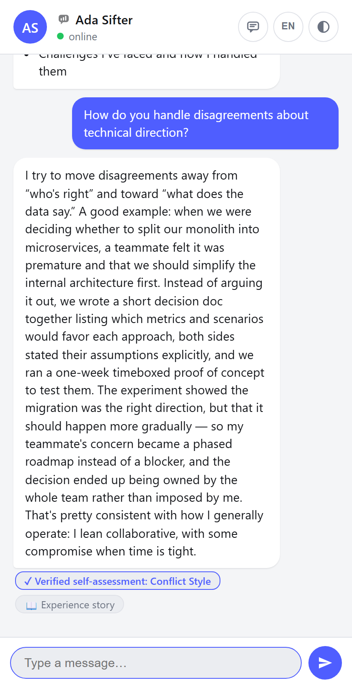
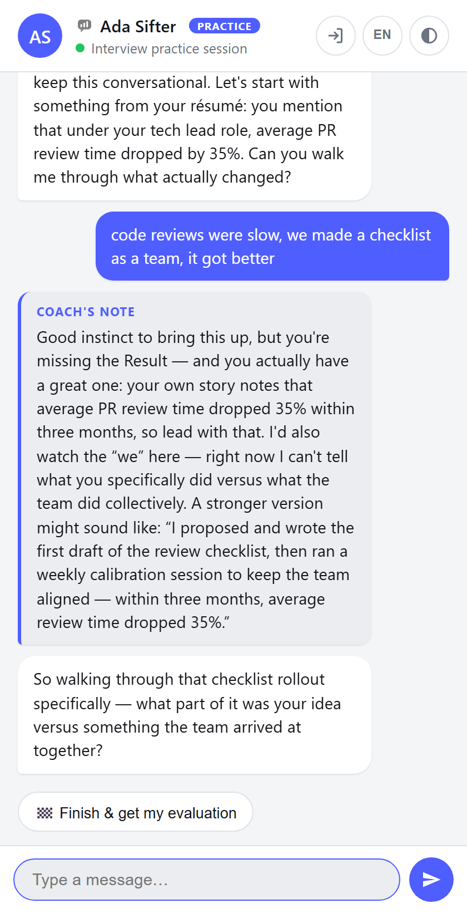
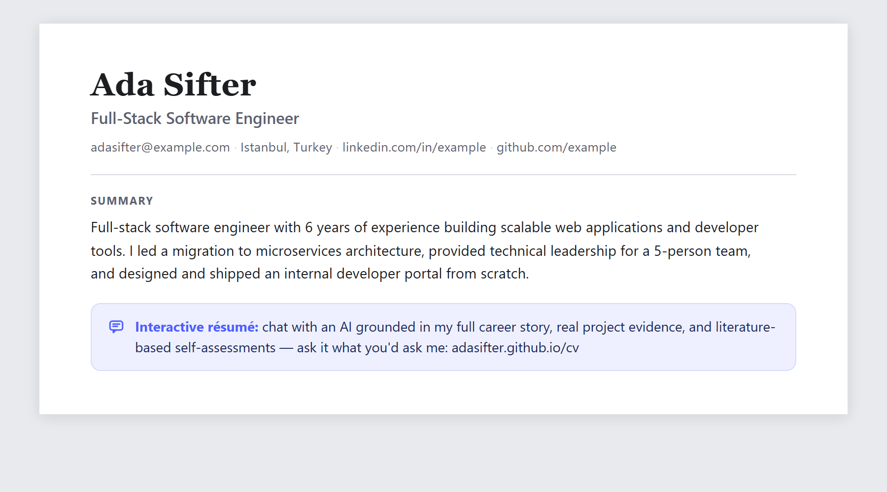
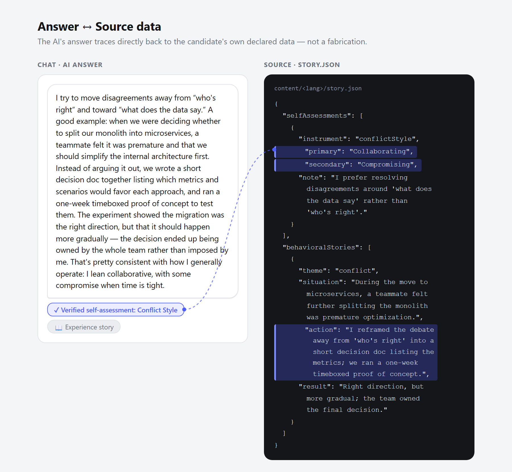

<p align="center"></p>

# Signal Sifter

<p align="center">
  <a href="https://enigmadevelop.github.io/resume-signal-sifter/"><strong>▶ Live demo</strong></a> ·
  <a href="https://enigmadevelop.github.io/resume-signal-sifter/?practice=1"><strong>🎯 Try practice mode live</strong></a> ·
  <a href="#get-your-own-fork--fill--deploy">Get your own</a>
</p>

<p align="center">
  <a href="LICENSE"></a>
  <a href="https://github.com/EnigmaDevelop/resume-signal-sifter/actions/workflows/deploy.yml"></a>
  <a href="CONTRIBUTING.md"></a>
  <a href="https://github.com/sponsors/EnigmaDevelop"></a>
</p>

An interactive, chat-style resume/CV. Visitors browse it like a messaging app in two modes: **static mode** (button-driven, 100% deterministic, no LLM calls) and **AI mode** (a real LLM conversation grounded strictly in your resume + story data, with per-answer source citations). For you, the candidate, there is a third, hidden face: an **interview practice simulator** that interviews you about your own story and coaches every answer.

Signal Sifter is built for the candidate first:

1. **A modern resume format** — an interactive page worth linking from the top of a traditional CV (see [Put it in your CV](#put-it-in-your-cv)).
2. **Interview preparation** — writing your `story.json` *is* structured interview prep (STAR stories, motivation, growth areas), and [practice mode](#interview-practice-mode-hidden) rehearses it with you.
3. **Self-knowledge** — five literature-based self-assessments you score yourself ([STORY_GUIDE.md](STORY_GUIDE.md)).

Recruiters benefit second: a diligent HR reviewer can pre-screen you by chatting with the AI, and every answer is cited back to your declared data ([Trust & methodology](#trust--methodology)).

Fork it, fill in your own JSON, deploy for free (GitHub Pages + Cloudflare Worker free tier + Groq free tier).

## What a recruiter sees

The public site is a two-speed experience for the people deciding whether to interview you:

- **Static mode first** — a deterministic, button-driven tour of your CV (experience, projects, skills) that works with zero backend and never hallucinates, because it isn't generated.
- **AI mode on demand** — the ✦ icon opens a free-form conversation with an AI that answers *as you*, grounded strictly in your declared résumé + story data. **Every answer carries source badges**, and ✓ badges open a methodology card explaining exactly which published framework the claim comes from.
- **Honesty as a feature** — ask it "are these assessments certified?" and it says no: structured self-report via an open questionnaire. Recruiters trust what they can audit (see [Trust & methodology](#trust--methodology)).

<p align="center"></p>

So a diligent recruiter can effectively **pre-screen you by interrogating your career story** — asking the behavioral questions they'd ask in a first call, and getting cited answers.

## Interview practice mode (hidden)

This one is for **you**, the candidate — visitors never see it.

Open your deployed site with **`?practice=1`** (optionally `&persona=manager`) and the roles flip: the AI plays an HR screener — or the hiring manager — and runs a soft-skill behavioral interview grounded in *your* résumé and story. After every answer you get a short coaching note covering:

- **STAR structure** — which part is missing (an unmeasured Result is the most common gap),
- **Ownership & specificity** — vague "we did X" phrasing that hides your individual contribution,
- **Professional tone** — calm, positive framing, with one example sentence when yours was weak,
- **Consistency with your own story** — e.g. forgetting your own headline metric.

Finish any time with the 🏁 chip to get an overall evaluation (2 strengths, 2 growth priorities, a one-sentence hiring signal).

<p align="center"></p>

The entrance is deliberately unlinked: visitors and recruiters only ever see the public represent mode. It requires AI mode to be enabled, is protected by the same rate limit and prompt guardrails, and exposes no data the public mode doesn't already send.

## AI budget & bring your own provider

The default zero-cost setup runs on Groq's free tier: ≈**100k tokens/day**. Every request embeds your full résumé+story in the prompt, so that works out to roughly **20–25 visitor Q&As per day**, or **~2 full practice sessions** — plenty for a personal site, tight if you practice a lot.

The Worker speaks the OpenAI-compatible chat-completions contract, so you can point it at **any provider** for longer conversations: set `LLM_ENDPOINT`/`LLM_MODEL` in `worker/wrangler.toml` and a `LLM_API_KEY` secret (OpenAI, OpenRouter, Together, Mistral, DeepSeek… — examples in [worker/README.md](worker/README.md)). No frontend changes needed.

Roadmap idea (not implemented): a visitor-supplied API key field, so candidates practicing on a fork could pay for their own tokens without touching the deployed Worker's key.

## Put it in your CV

The product only works if people find it — put the link where a recruiter's eyes already are, directly under your CV's summary (it also fits LinkedIn's website field and an email signature):



Suggested wording:

> **EN:** *Interactive résumé — chat with an AI grounded in my full career story, real project evidence, and literature-based self-assessments. Ask it what you'd ask me: `https://<you>.github.io/<repo>`*
>
> **TR:** *İnteraktif özgeçmiş — kariyer hikayem, somut proje kanıtlarım ve literatüre dayalı öz-değerlendirme sonuçlarımla temellendirilmiş yapay zekâyla sohbet edin. Bana soracaklarınızı ona sorun: `https://<siz>.github.io/<repo>`*

Short variants for tight layouts:

> **EN:** *Prefer asking to reading? My interactive AI résumé: `<link>`*
> **TR:** *Okumak yerine sormayı mı tercih edersiniz? İnteraktif AI özgeçmişim: `<link>`*

## Trust & methodology

Recruiters rightly distrust "an AI said so". Signal Sifter makes the grounding inspectable instead of asking for faith:

- **Source badges on every AI answer** — the Worker forces each reply to start with a machine-readable self-citation (`§SRC:…§`) drawn from a closed list of résumé/story fields; the client renders it as 📄/📖 badges under the bubble. `none` is used when an answer isn't grounded in anything (greetings, refusals).
- **✓ Verified self-assessment badges are clickable** — tapping one opens a methodology card naming the instrument and its literature basis (Belbin 1981; Thomas–Kilmann 1974; Deci & Ryan's Self-Determination Theory; TIPI, Gosling et al. 2003; Goleman, HBR 2000) plus an honest disclaimer: self-scored with the open questionnaire in [STORY_GUIDE.md](STORY_GUIDE.md) — self-report, not certification.
- **The AI answers methodology questions honestly** — ask it "are these assessments certified?" and it explains the self-report framing instead of inflating credentials.

One picture of the whole idea — an AI answer next to the exact `story.json` lines it is grounded in:



## Screenshots & branding

`npm run shots` regenerates every image under `docs/screenshots/` (both languages, light/dark, practice mode, the grounding proof, and the CV snippet). It spins up a local mock worker (`npm run mock`, port 8788) that streams scripted replies with real citation/coaching markers — **zero Groq tokens spent**, fully reproducible. Requires `npx playwright install chromium` once.

Logo and favicon prompts for image generation live in [docs/branding.md](docs/branding.md).

## Get your own (fork → fill → deploy)

1. **Fork** this repo (or "Use this template") and clone it.
2. **Run locally:** `npm install && npm run dev` — you get the demo persona ("Ada Sifter") in static mode immediately; no keys or backend needed.
3. **Make it yours:** edit `content/<lang>/resume.json` and `buckets.json` (schema below). Optional but recommended: fill `story.json` with [STORY_GUIDE.md](STORY_GUIDE.md) — it powers the AI mode's depth, the ✓ verified badges, and the practice interviewer. Keep `id`s identical across languages; drop a language by removing it from `config.json`'s `supportedLanguages`.
4. **Brand it (optional):** replace `public/logo.png` / `public/favicon.svg` and the avatar — prompts and sizes in [docs/branding.md](docs/branding.md).
5. **Publish:** push to `main`, then in repo Settings → Pages set Source to **GitHub Actions**. The included workflow ([.github/workflows/deploy.yml](.github/workflows/deploy.yml)) builds and deploys automatically; your site appears at `https://<you>.github.io/<repo>/`. The site is fully static at this point.
6. **Enable AI mode (optional):** deploy the Cloudflare Worker and set your key — 10-minute guide in [worker/README.md](worker/README.md) — then set `content/config.json`:
   ```json
   "aiMode": { "enabled": true, "endpoint": "https://<your-worker>.workers.dev" }
   ```
   and push. Free on Groq's tier, or [bring your own provider](#ai-budget--bring-your-own-provider).
7. **Use it:** put the link in your CV ([wording above](#put-it-in-your-cv)), and rehearse with `?practice=1` before real interviews.
8. **Regenerate marketing screenshots (optional):** `npm run shots` — uses a local mock, spends no tokens.

## Contributing

Bug reports, translations, and PRs are welcome — see [CONTRIBUTING.md](CONTRIBUTING.md). Questions and show-and-tell live in [Discussions](https://github.com/EnigmaDevelop/resume-signal-sifter/discussions). Licensed under [MIT](LICENSE).

## Support this project

If Signal Sifter landed you an interview (or just made your CV more fun), you can support it with a one-time coffee at **[github.com/sponsors/EnigmaDevelop](https://github.com/sponsors/EnigmaDevelop)** — also reachable via the **Sponsor** button at the top of this repo (`.github/FUNDING.yml` — forkers: swap in your own handle or delete the file). Heads-up for creators in Türkiye: GitHub Sponsors pays out to Turkish bank accounts; Buy Me a Coffee currently does **not** support payouts to Türkiye.

---

The section below documents the content schema.

## Content schema

All content lives under `content/`. Nothing else needs to change to reskin the site with your own resume.

```
content/
├── config.json      # site-level settings (not resume content)
├── tr/
│   ├── resume.json  # structured CV data
│   ├── buckets.json # static-mode question/answer tree
│   └── story.json   # optional narrative data for AI mode (see STORY_GUIDE.md)
└── en/
    ├── resume.json
    ├── buckets.json
    └── story.json
```

Add a new language by adding a `content/<lang>/` folder with the same two files and listing the language code in `config.json`'s `supportedLanguages`.

### `config.json`

| Field | Type | Description |
|---|---|---|
| `siteTitle` | string | Browser tab title / site name |
| `defaultLanguage` | string | Language code used on first load |
| `supportedLanguages` | string[] | Language codes with a matching `content/<lang>/` folder |
| `theme.default` | `"system" \| "light" \| "dark"` | Initial theme before the user picks one |
| `aiMode.enabled` | boolean | Turns AI mode on/off. When `false`, the site is static-only — no Worker required |
| `aiMode.endpoint` | string | URL of your deployed Cloudflare Worker (see the Worker section, added in a later step) |

### `resume.json`

The full structured CV. This is the single source of truth — both static mode and AI mode read from it (AI mode embeds it directly in the system prompt; no RAG/vector DB needed since a resume comfortably fits in an LLM context window).

```jsonc
{
  "profile": {
    "name": "string",
    "title": "string",
    "avatar": "string | null",   // URL/path, or null to show initials
    "location": "string",
    "statusText": "string",      // shown next to the online dot, e.g. "online"
    "summary": "string",
    "links": [{ "label": "string", "url": "string" }]
  },
  "experience": [
    {
      "id": "string",            // referenced from buckets.json
      "company": "string",
      "role": "string",
      "start": "YYYY-MM",
      "end": "YYYY-MM | \"present\"",
      "location": "string",
      "highlights": ["string"]
    }
  ],
  "projects": [
    {
      "id": "string",            // referenced from buckets.json
      "name": "string",
      "description": "string",
      "url": "string",           // "" if none
      "tags": ["string"]
    }
  ],
  "education": [
    { "school": "string", "degree": "string", "field": "string", "start": "YYYY", "end": "YYYY" }
  ],
  "skills": [
    { "category": "string", "items": ["string"] }  // category name is referenced from buckets.json
  ]
}
```

### `buckets.json`

The static-mode navigation tree: **menu → category → question → answer**.

```jsonc
{
  "menu": {
    "title": "string",           // greeting shown above the category chips
    "categories": [{ "id": "string", "label": "string", "icon": "string" }]
  },
  "categories": {
    "<category id>": {
      "label": "string",
      "intro": "string",         // shown when entering the category
      "questions": [
        {
          "id": "string",
          "label": "string",     // the chip / question text
          "answer": [ /* content blocks, rendered in order */ ]
        }
      ]
    }
  }
}
```

Every `category.id` in `menu.categories` must have a matching key under `categories`.

#### Answer content blocks

An `answer` is an array of blocks rendered in sequence. Supported types:

| Type | Fields | Renders |
|---|---|---|
| `text` | `text` | A plain paragraph |
| `list` | `items: string[]` | A bullet list |
| `link` | `label`, `url` | A single link |
| `links` | *(none)* | All of `profile.links` from `resume.json` |
| `project` | `ref: <project id>` | One project card, looked up in `resume.json.projects` |
| `projects` | *(none)* | Every project card |
| `experience` | `refs?: <experience id>[]` | The listed experience entries, or all of them if `refs` is omitted |
| `skills` | `refs?: <skill category>[]` | The listed skill categories, or all of them if `refs` is omitted |

`project`/`experience`/`skills` blocks reference `resume.json` by id instead of duplicating data, so the resume stays the single source of truth.

Keep `id`s (categories, questions, experience, projects) identical across every `content/<lang>/` folder — only the human-facing strings should be translated. AI mode and any future tooling assume ids are language-independent.

### `story.json` (optional, AI mode only)

Narrative context beyond the résumé's facts — motivation, values, career goals, self-assessments, and STAR-format behavioral stories. It's the difference between AI mode saying "that's not covered in my résumé" and actually answering "why did you choose this field?" or "what's the hardest thing you've dealt with?".

Entirely optional: skip the file (or leave fields empty) and AI mode falls back to `resume.json` alone, same as today. See **[STORY_GUIDE.md](STORY_GUIDE.md)** for how to fill it in, including five literature-based self-assessments you can pick from depending on your experience — team role and conflict style work for anyone, leadership style only if you've actually led a team.

```jsonc
{
  "motivation": "string",
  "values": ["string"],
  "workStyle": "string",
  "careerGoals": "string",
  "strengths": ["string"],
  "growthAreas": ["string"],
  "selfAssessments": [
    // Each entry is independently optional — include only what fits your journey.
    // "instrument" is one of: teamRole, conflictStyle, motivationDrivers, personalitySnapshot, leadershipStyle
    { "instrument": "string", "primary": "string", "secondary": "string", "note": "string" }
  ],
  "behavioralStories": [
    {
      "theme": "string",     // e.g. "challenge", "conflict", "failure", "achievement"
      "situation": "string",
      "task": "string",
      "action": "string",
      "result": "string"
    }
  ],
  "aiIntroTopics": ["string"] // shown as a "you can ask me about..." list when AI mode starts
}
```

The Worker embeds this in the system prompt alongside `resume.json` and is instructed to treat every `selfAssessments` entry as your own self-report, never something it infers or adds on its own.
